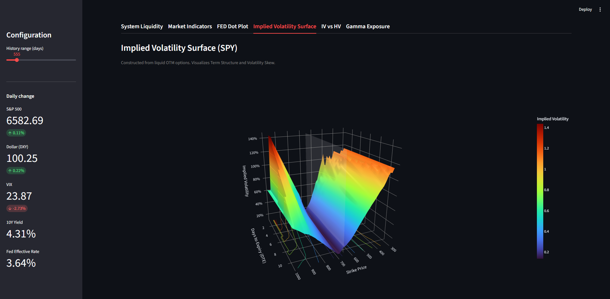

# Macro Liquidity & Volatility Dashboard

An educational dashboard built with Streamlit to visualize macroeconomic liquidity and options market tail-risk. This project serves as a practical tool for understanding how central bank mechanics and options data interact with the broader market.



## Features

* **Macro Liquidity Engine:** Tracks Federal Reserve Net Liquidity (WALCL - TGA - RRP) against the S&P 500, adjusting dynamically to show true systemic bank reserves in Trillions ($T).
* **Options Market Analysis:** Includes interactive 3D Implied Volatility Surfaces, IV vs HV comparisons, and Gamma Exposure profiles.
* **Fed Policy Tracking:** Visualizes the FED Dot Plot and implied rate paths.
* **Live Sidebar Dashboard:** Tracking of daily changes in the S&P 500, DXY, VIX, 10Y Yield, and the Fed Effective Rate.

## Tech Stack

* **Frontend:** Streamlit
* **Data Processing:** Pandas, NumPy, SciPy
* **Visualization:** Plotly
* **Market Data:** yfinance / FRED Data

## Local Setup (Recommended) 
Running the application locally is **highly recommended** due to Yahoo Finance API rate-limiting on shared cloud environments (e.g., Streamlit Cloud). Local execution uses your dedicated IP, ensuring much higher stability for options data fetching.
1. **Clone the repository**
2. **Install dependecies:**
```pip install -r requirements.txt```
3. **Configure API Keys (Streamlit Secrets):**
```Macro-Liquidity-Volatility-Dashboard/.streamlit/secrets.toml``` \
```FRED_API_KEY = "sk-your-secret-key-here"``` \
You can get free FRED API key here -> [FRED API](https://fred.stlouisfed.org/docs/api/fred)
4. **Run the App:**
```streamlit run app.py```

##  Important Note on Data Availability (After-Hours Behavior)

Please note that this dashboard relies on the free Yahoo Finance API (`yfinance`) for live options chain data. Because of this, you may encounter **empty charts, zeroed-out Net GEX, or missing IV Surfaces** if you run the application outside of regular US Market Hours.

**Why does this happen?**
Unlike paid institutional data feeds (e.g., Bloomberg, OptionMetrics) that provide End-of-Day (EOD) snapshots, Yahoo Finance reflects the *live* state of the order book. After the market closes (4:15 PM EST), Market Makers withdraw their quotes. Consequently:
* **Bid/Ask spreads drop to zero**, causing standard Black-Scholes implied volatility calculations to fail or return `0.00%`.
* **Open Interest (OI) and Volume data may temporarily wipe** or report inaccurately until the clearinghouse updates the next morning.
* Without active pricing and IV, the Delta and Gamma mathematical models cannot compute, resulting in flat or empty charts.

**The Solution:**
For accurate analysis and visualization, **please run this dashboard during active US market hours (9:30 AM – 4:15 PM EST)**. If you wish to develop or backtest after hours, it is highly recommended to cache an intraday `.csv` snapshot of the options chain and route the dashboard to read from your local file.
